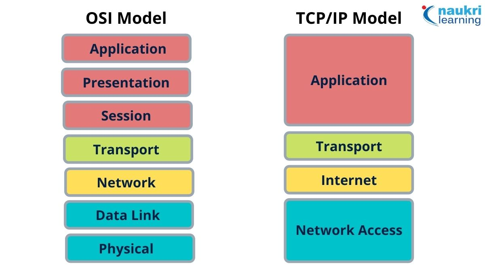

# **WHAT IS THE OSI MODEL**
The OSI (Open Systems Interconnection) is a conceptual model for how network communication is suppose to work, it is a mental model on how computer are suppose to communicate with each other. the OSI MODEL is important because it allows people to visualise in their mind all of the different components of network communication and then be able to solve problems on different layers.

The OSI model is a theoretical framework for mapping how applications and devices link and send data over a web of connections. The OSI Model is called a “reference model” because it is rarely used in practical applications.

OSI layers are, indeed, fundamental to the OSI Model. The framework is a stack of seven layers, each performing a specific function, yet working together to transmit data from one networked device to another.

## **LAYERS OF THE OSI MODEL**
In the OSI model, the communications between systems are split into seven different abstraction layers: 

- **Layer seven - Application Layer** : the application layer makes data usable to the software. It provides protocols that allow software to send and receive information and present meaningful data to users.

 - **Layer six - Presentation Layer** : this is the layer where encrytion and compression take place.one of the big thing with networking is able to make your data smaller because it makes it faster to send accross the internet.

- **Layer five - Session Layer** : whenever two computer are communicating with each other, the open up a session, and the communicate without reauthenticating.this layer maintains connections and its responsible for controlling ports and session.The session layer creates communication channels, called sessions, between devices. It is responsible for opening sessions, ensuring they remain open and functional while data is being transferred, and closing them when communication ends.

- **Layer four - Transport Layer**: the transport layer disassemble and reassemble data.The transport layer takes data transferred in the session layer and breaks it into “segments” on the transmitting end. It is responsible for reassembling the segments on the receiving end, turning it back into data that can be used by the session layer.the TCP(Tranmission control protocol) is at this layer , it is responsible of dissassembling the files and reassembling them.

- **Layer three - Network Layer**: this is the connection between different networks. The network layer has two main functions. One is breaking up segments into network packets, and reassembling the packets on the receiving end. The other is routing packets by discovering the best path across a physical network. The network layer uses network addresses (typically Internet Protocol addresses) to route packets to a destination node.

- **Layer two - Data link Layer**: connection on same network, The Data Link layer is closely related to the Network Layer but usually refers to communication between locally-connected devices. For instance, the data link layer might model connections between on-premises workstations and routers.
This layer is composed of two parts—Logical Link Control (LLC), which identifies network protocols, performs error checking and synchronizes frames, and Media Access Control (MAC) which uses MAC addresses to connect devices and define permissions to transmit and receive data.
- **Layer one -Physical Layer**: its the physical wiring and connection.The Physical Layer covers all of the physical infrastructure and equipment needed to transfer data. The physical layer includes network cables and switches, as well as radio frequency links, voltage regulators, and routing devices.It defines the connector, the electrical cable or wireless technology connecting the devices, and is responsible for transmission of the raw data, which is simply a series of 0s and 1s, while taking care of bit rate control.

## USING THE OSI MODEL FOR TROUBLESHOOTING

Starting at the bottom of the OSI model and working your way up is recommended. Each layer of the OSI model, starting at layer 1, is evaluated and eliminated as the source of the problem until the problem is diagnosed. And, as those in the IT business know, once the problem is diagnosed, the fix is usually easy to find. I will document each layer and offer some example troubleshooting steps for each.

**Layer 7 - Application**

Troubleshooting application layer involves the following questions:

-Can the application connect to the server/data?

-Do other applications work on the same machine?

-Does the same application work on other machines?

-Is there an error message we can search for?

-Are we fully patched?

**Layer 6 - Presentation**
Troubleshooting presentation layer problems typically involves verifying data formats, checking encryption keys, and using protocol analyzers to decode network traffic.

**Layer 5 - session**

Issues at this layer may include session timeouts, protocol mismatches, and session hijacking attempts. Troubleshooting session layer problems often involves checking application logs, analyzing network traffic patterns, and ensuring proper session establishment protocols.

**Layer 4 - Transport**

Troubleshooting transport layer issues typically involves analyzing packet captures, checking for firewall configurations, and adjusting TCP/IP parameters.Basic questions asked are as follows:

-Do some protocols work and others don’t?

-Is there a software firewall running on the PC/server?

-What are the network firewall rules?

**Layer 3 - Network**

Troubleshooting network layer problems often involves verifying IP configurations, checking routing tables, and using diagnostic tools like ping and traceroute. i.e

-Do we have an IP address, mask and default gateway?

-Can we ping our default gateway?

-Can we ping past our default gateway?

-Are names being resolved to IP addresses (DNS)?

**Layer 2 - Datelink**

Troubleshooting data link layer problems typically involves checking for proper configuration of network interfaces, verifying MAC addresses, and diagnosing network congestion. i.e 

-Can we see devices on our local network?

-Do we have old MAC address entries in the ARP table?

-How “far” can we ping?

-Do we have a speed/duplex mis-match (many errors on a port)?

-Do we have a spanning tree loop (high broadcast traffic)?

**Layer 1 - Physical**

Troubleshooting physical layer issues often involves checking cable connections, replacing faulty hardware, and ensuring proper power supply. i.e 

-Do we have power?

-Are the Ethernet cables fully connected?

-Do we have link-beat?

-Has any equipment failed?

## TCI/IP VS THE OSI MODEL

#### **TCP/IP Model**

TCP/IP stands for Transmission Control Protocol/Internet Protocol. It has 4 layers named as Physical layer, Network layer, Transport layer, and Application layer.  It also can be used as a communications protocol in a private computer network. 

#### **OSI Model
OSI stands for Open Systems Interconnection. It has 7 layers Physical layer, Data Link layer, Network layer, Transport layer, Session layer, Presentation layer, and Application layer. Each layer performs its task independently.

